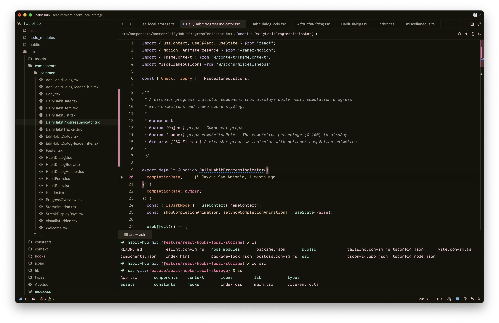
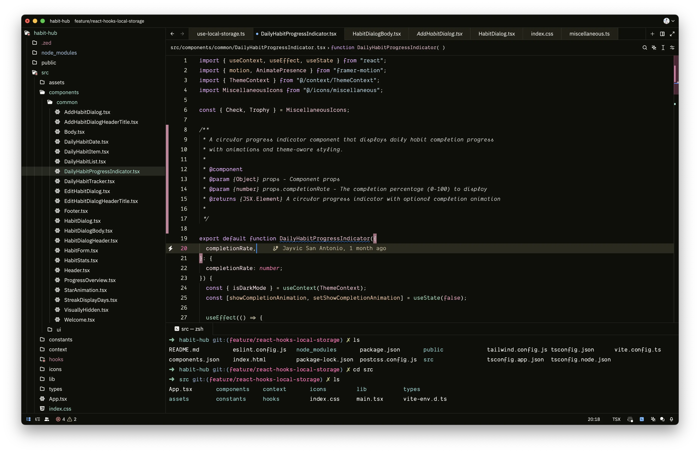
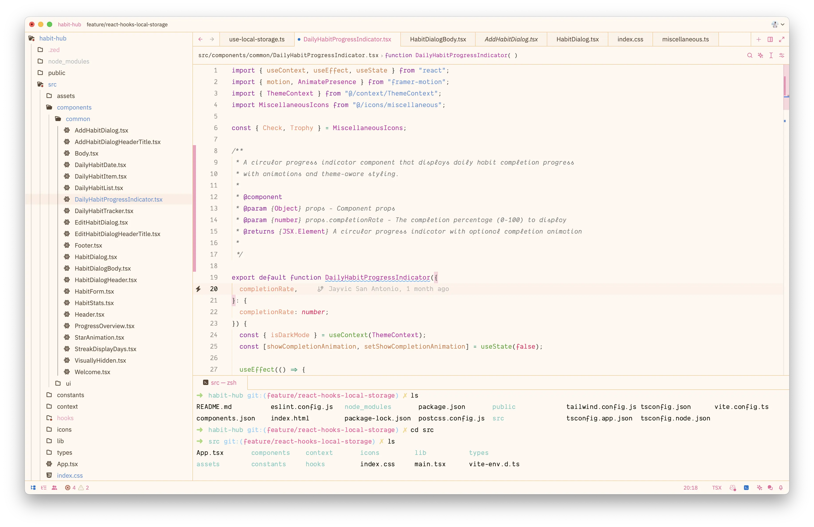

# Barbenheimer Zed Theme

This is a Zed Editor theme inspired by the Internet phenomenon of the same name. It combines the pink and playful aesthetics of Barbie with the dark and dramatic tones of Oppenheimer.

## Installation

1. Open the **Extensions** page in Zed Editor.
2. Search for **Barbenheimer**.
3. Click **Install**.

## Themes

This theme pack includes three variants:

### Barbenheimer Dark

A dark theme with a vibrant pink accent color.

### Barbenheimer High Contrast

A high contrast dark theme with a bright pink accent color.

### Barbenheimer Light

A light theme with a soft pink accent color.

## Customization

You can customize the theme by overriding specific attributes in your `settings.json` file. See the [Zed Editor documentation](https://zed.dev/docs/themes) for more information.

## Contributing

If you find any bugs or have suggestions for improvement, please feel free to open an issue or submit a pull request.

## License

This theme is licensed under the MIT License.
